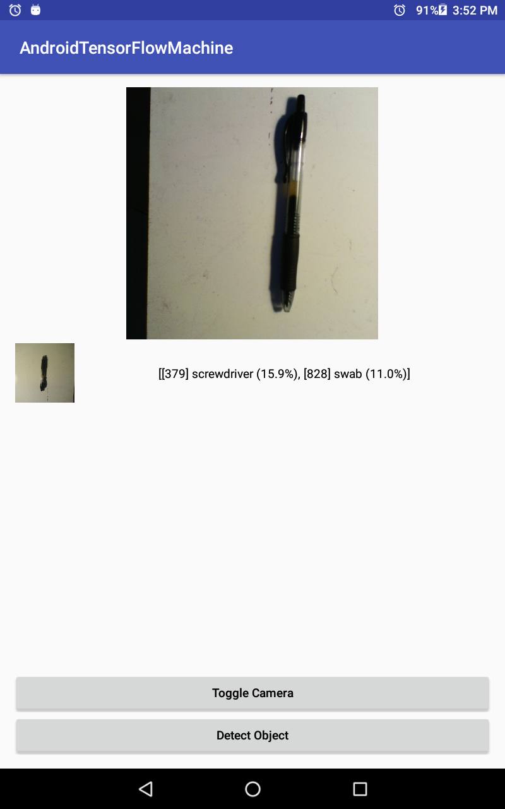
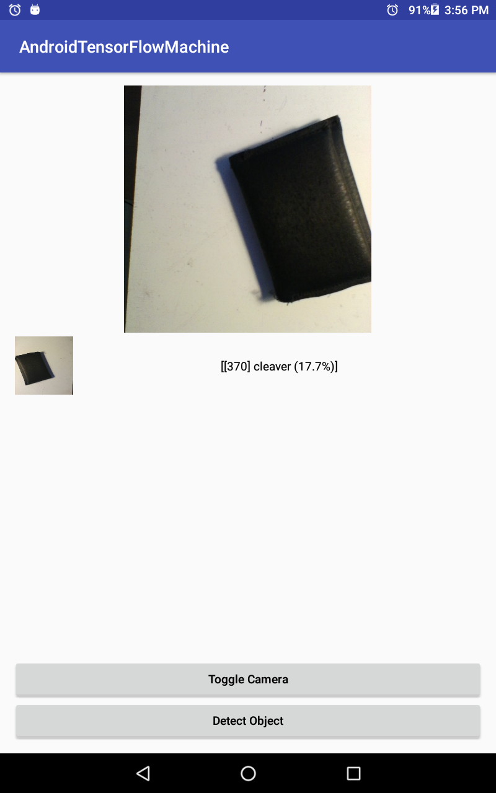

# Android TensorFlow Machine 

* [Link to Java API TF 1.2](https://www.tensorflow.org/api_docs/java/reference/org/tensorflow/package-summary)
* forked repo had bug TF lib requres min sdk 18
* Official android link to lib [Link](http://ci.tensorflow.org/view/Nightly/job/nightly-android/lastSuccessfulBuild/artifact/out/native/libtensorflow_inference.so/armeabi-v7a/libtensorflow_inference.so) no need to build
* This project include an example for object detection for an image taken from camera using TensorFlow library.

  
  

 
 
